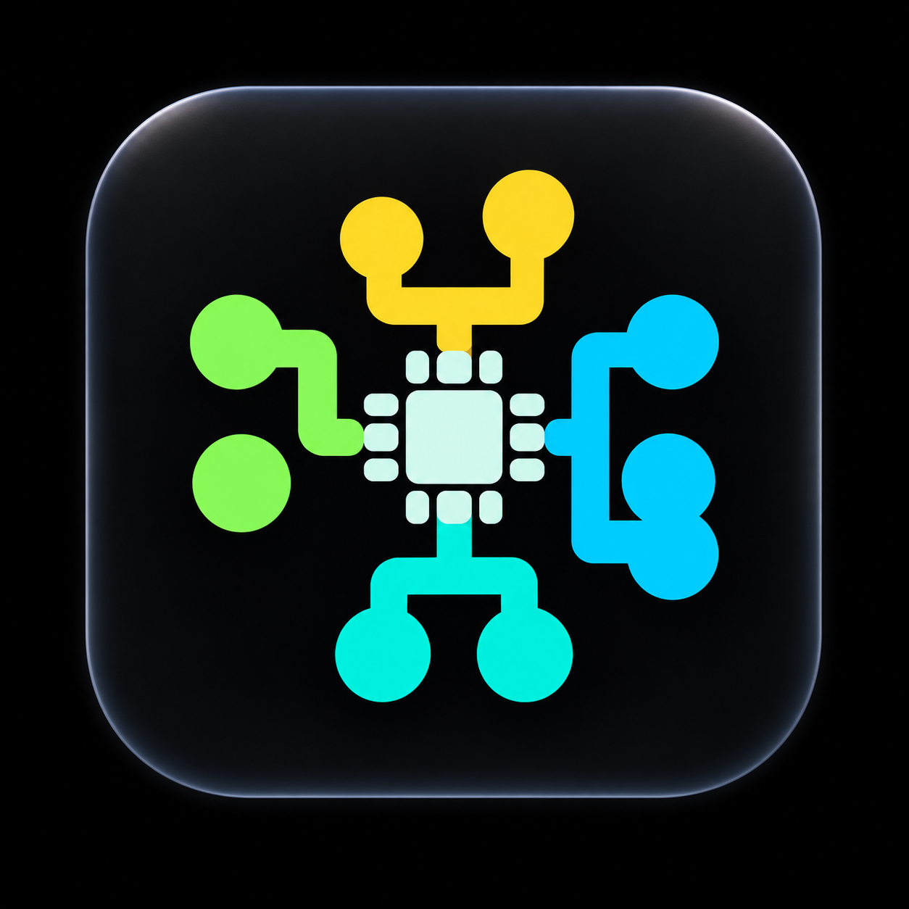
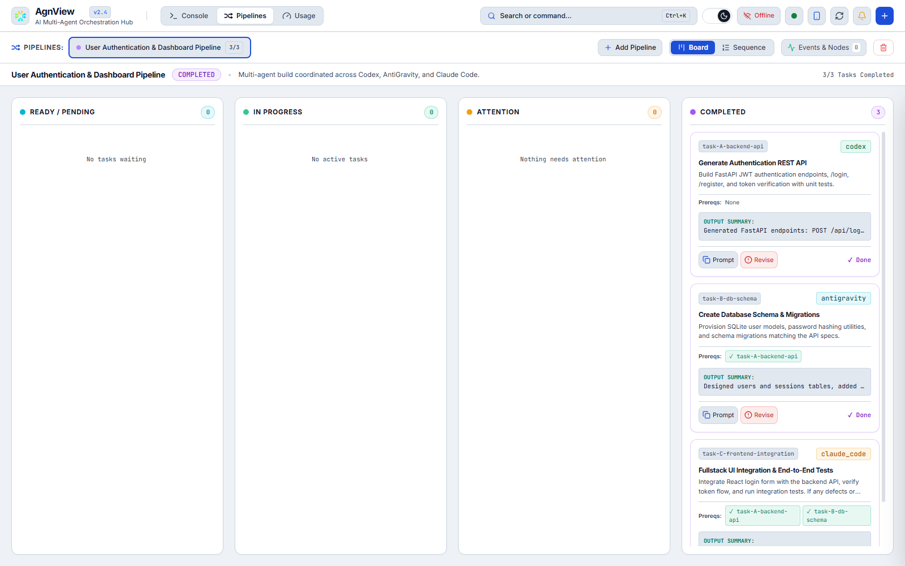
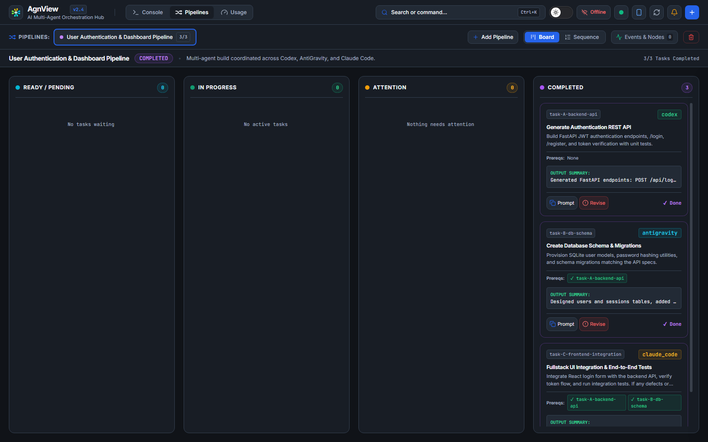
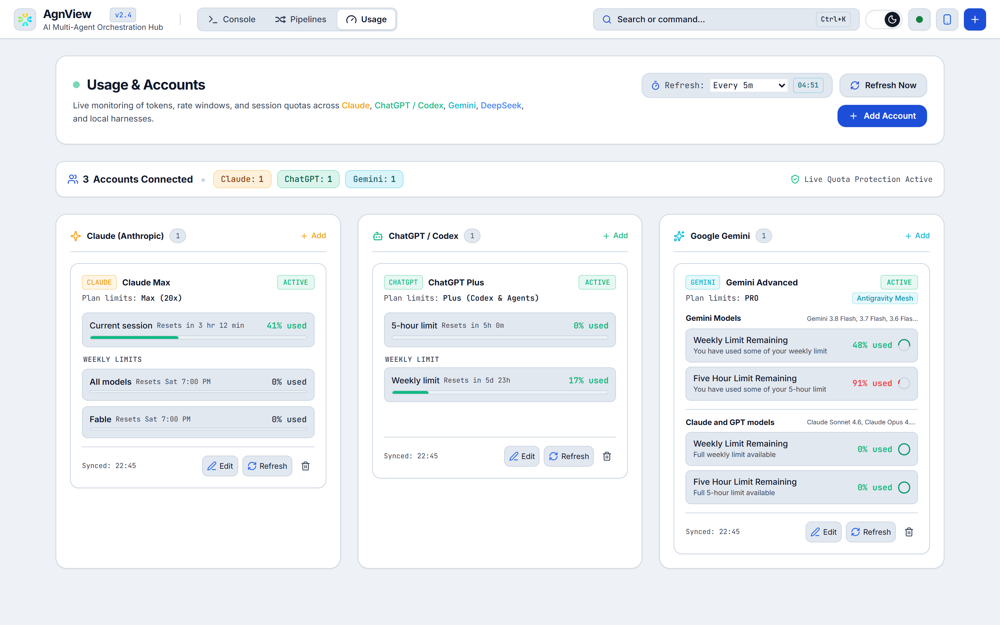
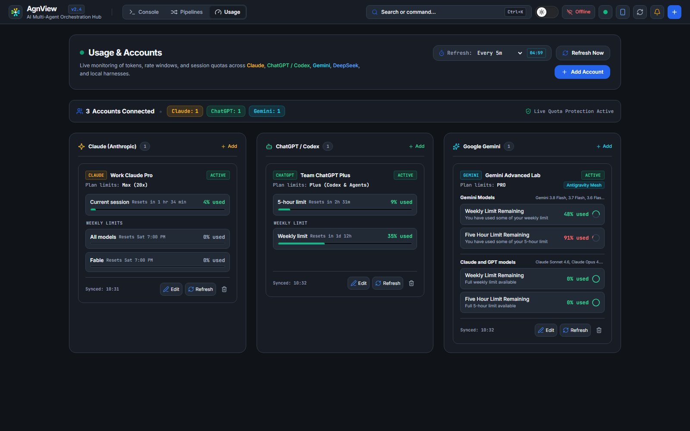

<div align="center">
  
  <h1>AgnView</h1>
  <p><strong>One screen for the coding agents already running on your machine.</strong></p>
  <p>
    <a href="https://github.com/tlaskar-git/AgnView/releases/latest/download/AgnView-windows-x64.zip"><strong>Download for Windows</strong></a>
    &nbsp;·&nbsp;
    <a href="https://github.com/tlaskar-git/AgnView/releases/latest">Release notes</a>
    &nbsp;·&nbsp;
    <a href="https://pypi.org/project/agnview/">PyPI</a>
  </p>
</div>

---

## What AgnView is

AgnView is a local dashboard and coordination hub for the agent CLIs you have
installed: Claude Code, Codex, AntiGravity, DeepSeek, and any local model you
run yourself. There are five known agent roles a task can be assigned to:
`claude_code`, `codex`, `antigravity`, `deepseek` and `custom`. It does three
things.

**Watch.** Every agent's output streams into one console, colour-coded by
agent, instead of being scattered across terminal tabs.

**Coordinate.** Describe a job as a set of tasks with dependencies. A task
stays blocked until the tasks it depends on complete, and when it starts, the
agent picks it up with the upstream summaries and artefacts attached. If one
agent finds a defect in another's work, it can send the task back for revision,
or mark it failed, which blocks everything downstream.

**Keep an eye on quotas.** Session and weekly limits for your Claude, ChatGPT,
Gemini, AntiGravity and DeepSeek accounts, in one place.

Every figure comes from the tool's own sign-in on this machine. AgnView reads
the sign-ins of Claude Code, Codex and AntiGravity, asks each provider for the
real windows, and shows which source a figure came from and how long ago it was
measured. A provider that publishes no figure says so, with the reason, rather
than showing a number nobody measured.

There is nothing to set up. On first start AgnView finds the tools signed in
on the machine and adds a card for each, and it keeps looking, so a tool you
sign in to later appears by itself. Sign-ins stay current without you opening
the tools: Claude Code is asked to renew its own sign-in before it expires, and
AntiGravity's is renewed in memory. AgnView never writes to another tool's
credentials. When a read fails, a card keeps its last real reading, with its
age, until that window resets.

AgnView runs entirely on your own machine. It is free, and there is nothing to
sign up for.

## Screenshots

| | Light | Dark |
|---|---|---|
| **Pipelines** |  |  |
| **Usage** |  |  |

## Supported platforms

| | |
|---|---|
| Windows | 10 and 11, as a desktop app or from the command line |
| macOS | 12 Monterey and later, Intel and Apple silicon |
| Linux | any distribution with Python 3.10 or newer |
| Python | 3.10 or newer |
| Browser | any current Chrome, Edge, Firefox or Safari |

## Clients

The AgnView hub in this repo covers Windows, macOS and Linux.

Mobile companion apps are in development. Links to their App Store and Google
Play listings will be added here once they are published.

AgnView does not install any coding agent for you. It watches and dispatches to
the CLIs already on your machine: Claude Code, Codex, AntiGravity or any other
tool you add as an adapter. Install the CLIs you want to use yourself, before
or after installing AgnView.

## Install

**On Windows, use the desktop app.** [Download AgnView for Windows](https://github.com/tlaskar-git/AgnView/releases/latest/download/AgnView-windows-x64.zip),
extract the `AgnView` folder to `%LOCALAPPDATA%\Programs\AgnView` and run
`AgnView.exe`. No Python is needed. See [Windows desktop app](#windows-desktop-app)
below for the other ways to install it.

**On macOS and Linux, or to run the hub from a terminal,** install the Python
package. The quickest way is not to install at all. [uv](https://docs.astral.sh/uv/)
fetches and runs AgnView in one command, with no clone and no virtualenv:

```bash
uvx agnview serve
```

To keep it around permanently:

```bash
uv tool install agnview      # or: pipx install agnview / pip install agnview
```

Working on AgnView itself? Install from source:

```bash
git clone https://github.com/tlaskar-git/AgnView.git
cd AgnView
pip install -e .
```

`agent-relay` is supported as an alias for the `agnview` command.

## Windows desktop app

On Windows, AgnView runs as a desktop app with its own window, so no browser
is needed. Pick one of three ways to install it.

**Download the app.** No Python is needed. Download
[`AgnView-windows-x64.zip`](https://github.com/tlaskar-git/AgnView/releases/latest/download/AgnView-windows-x64.zip) from the
[latest release](https://github.com/tlaskar-git/AgnView/releases/latest), extract the `AgnView` folder to
`%LOCALAPPDATA%\Programs\AgnView` and run `AgnView.exe`. Keep the whole folder
together, because the exe needs the files beside it. To update, quit AgnView
from the tray menu and replace the folder with the new one. Your accounts and
settings live in `~/.agnview` and are kept.

**Install from PyPI.** This needs Python 3.10 or later:

```bash
pip install "agnview[desktop]"
agnview-desktop
```

**Build it from source.** From a clone of this repository:

```powershell
.\tools\build-windows.ps1 -Install
```

This builds `AgnView.exe`, copies it to `%LOCALAPPDATA%\Programs\AgnView` and
adds a Start menu shortcut.

The app needs the Microsoft Edge WebView2 runtime, which Windows 11 and current
Windows Server include. It runs the hub on loopback and shows the dashboard in
its window.

- **Closing the window** minimises AgnView to the taskbar, and the hub keeps
  running. **Quit AgnView** in the tray menu stops it.
- **Start with Windows** in the tray menu is off until you turn it on. It
  creates a Task Scheduler sign-in task for your account, which starts AgnView
  hidden in the tray 15 seconds after you sign in. The same switch is in the
  dashboard under Browser Sync & Autostart.
- **Port.** The app serves on port 18845, away from the 8765 default of
  `agnview serve`, and moves to the next free port when that one is taken. Pass
  `--port` once to change it, and the app remembers it. Settings live in
  `~/.agnview/desktop.json`.

**What the Usage tab needs on the machine.** AgnView reads the installed apps'
own sign-ins, not a browser's. Being signed in to chatgpt.com or claude.ai in a
browser is not enough on its own.

| Card | Needs |
|---|---|
| Claude | Claude Code installed and signed in, with the `claude` command available |
| ChatGPT | Codex installed and signed in |
| AntiGravity | AntiGravity installed and signed in once. It can stay closed after that |
| Gemini | Nothing more. It reads through AntiGravity's sign-in |

## Start

```bash
agnview serve
```

The dashboard is then at <http://127.0.0.1:8765>.

By default AgnView binds `127.0.0.1`, so only your own machine can reach it. To
let your phone or another computer on the same network connect, opt in
explicitly:

```bash
agnview serve --listen-lan
```

Choose a different port with `--port`, and require a token from connecting
clients with `--token`.

On macOS and Linux, and on Windows without the desktop app, the hub starts
automatically at login. The first `agnview serve` registers the OS-native
autostart mechanism (the Windows Registry Run key, a macOS
LaunchAgent, or a Linux XDG autostart entry, depending on your platform) with
the options you served under, so a hub started with `--listen-lan` or a custom
`--port` comes back the same way after a reboot. Change those options and the
next `agnview serve` updates the registration. The pairing token is never
written into it: the hub reads the persisted one at every start.

`agnview autostart disable` removes it and remembers that you did, so later
starts leave it off. `agnview autostart enable` puts it back, and
`agnview autostart status` shows whether it is currently registered. The
switch in the dashboard settings does the same thing.

On a machine with the Windows desktop app installed, `agnview serve` does not
register itself at login. The desktop app's Start with Windows owns that, so a
browser-only hub cannot start first and take the port.

## Pair a phone

1. Start the hub with `agnview serve --listen-lan`.
2. Open the dashboard and choose the mobile option in the header to show the
   pairing QR code.
3. Scan it with the AgnView app on a device on the same network.

The QR code carries the hub's LAN address, its certificate fingerprint, and a
pairing key. Regenerating the code invalidates every device already paired.
`docs/PAIRING.md` is the full contract.

**Treat the pairing QR code like a password.** Anyone who can read it can reach
the hub, and the hub can run commands on this machine. See `SECURITY.md`.

## LAN pairing, plus a remote path if you want it

On your own local network, your machine and your phone talk to each other
directly. Nothing goes through anybody else's infrastructure, and no account
or setup is needed.

If your phone is off your home or office Wi-Fi, LAN pairing alone cannot reach
it. AgnView also accepts connections over iroh, which can carry the pairing QR
code and the console beyond the LAN without a VPN. See "Remote access" below
for what that depends on and how to opt out of it.

## Remote access

`docs/REMOTE-ACCESS.md` covers every path in order: LAN, bundled iroh, what
iroh depends on, running your own relay, and the overlay alternatives
(Tailscale, NetBird, an SSH local port forward, or an existing WireGuard
tunnel) via `--listen-overlay`.

Remote access uses iroh's free public relays. Most connections are direct and never touch a relay. Relayed connections are rate limited and carry no uptime guarantee. You can point AgnView at your own relay in Settings.

## Docker, and what a container cannot do

```bash
docker compose up -d
```

The hub is then at <http://localhost:8765>. The image runs as an unprivileged
`agnview` user and carries a `HEALTHCHECK` against the dashboard root, and the
compose file keeps `~/.agnview` (pairing token, adapters, notification config)
in a named volume so it survives rebuilds and restarts.

**A containerised hub cannot dispatch to CLI agents.** AgnView dispatches work
by executing the agent binaries on the host: `claude`, `codex`, `antigravity`
and the rest, with their own credentials, config and your working tree. A
container sees none of that.

- Docker suits watching and managing a pipeline: the dashboard, the REST and
  SSE API, job and dependency state, web-LLM prompt generation, quota
  monitoring, and mobile pairing, with remote worker daemons doing the actual
  execution.
- A native install suits dispatch. If you want AgnView to run Claude Code,
  Codex or AntiGravity for you, install it on the machine where those CLIs
  live.

## Command line

`agnview serve` runs the hub. The rest of the commands drive it, so an agent
can take part in a pipeline from a script:

| Command | Purpose |
|---|---|
| `create-job` | Create a job from a YAML or JSON pipeline file |
| `status` | Show job and task status |
| `wait` | Block until a task's dependencies are satisfied |
| `claim` | Claim a task and begin work |
| `complete` | Mark a task complete with a summary |
| `reject` | Send a task back to its agent for revision |
| `my-tasks` | List tasks assigned to an agent |
| `nodes` | List connected agent instances |
| `worker` | Poll for assigned tasks as a daemon |
| `export-prompt` | Build a context prompt for a web LLM |
| `usage` | Show live subscription quotas |
| `autostart` | Enable, disable, or check starting the hub at login |

Run any of them with `--help` for the full set of options.

## How a pipeline runs

1. Create a job whose tasks name their dependencies. Tasks with no unmet
   dependencies start ready; the rest start pending.
2. An agent claims a ready task, which moves it to in progress.
3. Completing a task records its summary and artefacts, and unlocks every task
   whose dependencies are now met.
4. An agent that finds a defect upstream requests a revision. The upstream task
   reopens and its dependents go back to pending until it is fixed.
5. A task that cannot be finished is marked failed, which blocks everything
   downstream of it and fails the job.

Every one of these changes is pushed to open dashboards over Server-Sent
Events, so a second tab or a paired phone follows along without a reload.

## Licence

MIT. See [`LICENSE`](LICENSE).
